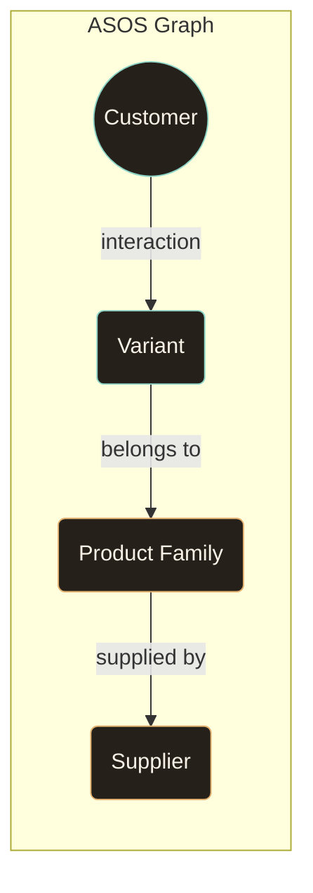
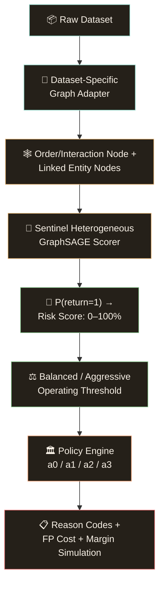
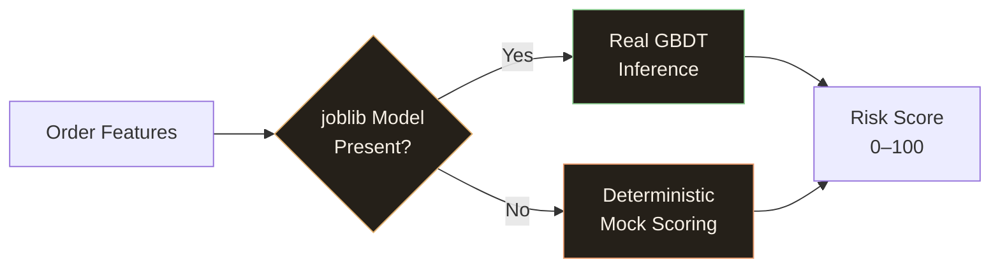
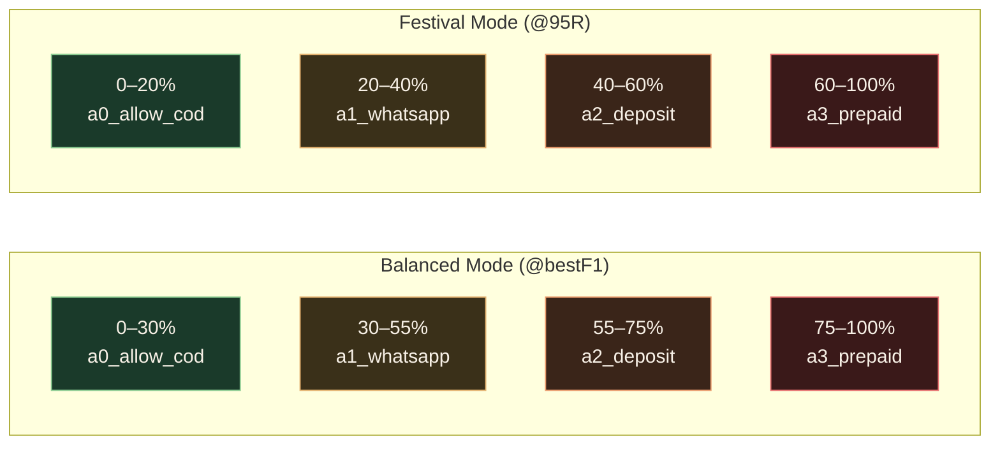
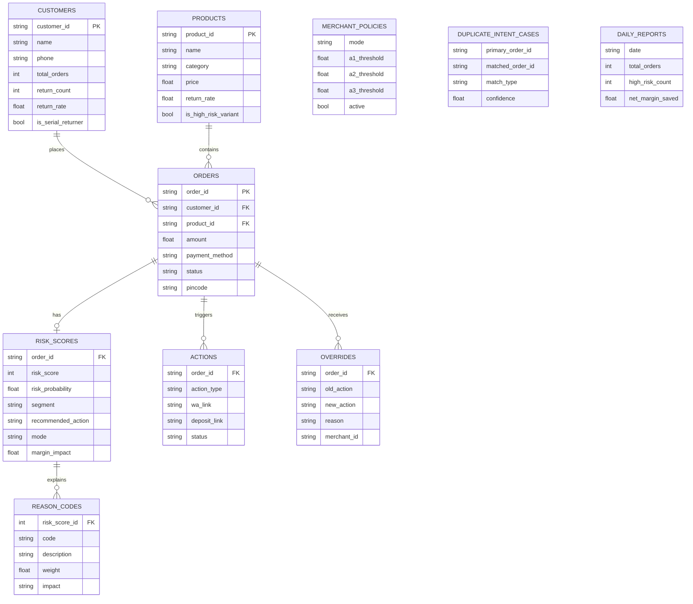

# System Architecture

Sentinel v4 is a graph-neural risk decision system. The core idea: **use the same GNN scorer across datasets, but change the graph builder** according to the fields each dataset exposes.

## Core Research Idea

The ASOS GraphReturns dataset has natural customer-product graph structure, which Sentinel uses to model complex return relationships.

## High-Level Pipeline

### GNN Model Configuration

| Component | Value |
|---|---:|
| Model | `SentinelHeteroGraphSAGE` |
| Embedding dimension | 48 |
| Hidden dimension | 128 |
| GNN layers | 2 |

---

## Layer-by-Layer Breakdown

### 1. Feature Engine (`feature_engine.py`)

Extracts 13 leakage-safe features from raw order, customer, and product data:

| # | Feature | Source | Type |
|---|---|---|---|
| 1 | `customer_return_rate` | Customer history | Float 0–1 |
| 2 | `product_return_rate` | Product history | Float 0–1 |
| 3 | `category_risk` | Category lookup table | Float 0–1 |
| 4 | `price_band_risk` | Order amount buckets | Float 0–1 |
| 5 | `customer_product_pair_risk` | Composite signal | Float 0–1 |
| 6 | `is_cold_customer` | First-time buyer flag | Boolean |
| 7 | `is_cold_variant` | Low-sale product flag | Boolean |
| 8 | `is_serial_returner` | ≥40% return rate + ≥2 returns | Boolean |
| 9 | `is_high_risk_variant` | ≥30% product return rate | Boolean |
| 10 | `cod_signal` | Payment method | Float |
| 11 | `duplicate_intent_score` | Duplicate detector output | Float 0–1 |
| 12 | `amount` | Order value (₹) | Float |
| 13 | `payment_method` | COD or PREPAID | Categorical |

**Design choices:**
- Category risk uses a static lookup map (fashion: 0.35, footwear: 0.40, etc.) that can be replaced with learned category priors from production data
- Price banding uses four tiers (<₹500, ₹500–1500, ₹1500–3000, >₹3000) to avoid overfitting on exact amounts
- `customer_product_pair_risk` is a weighted composite that approximates customer-product graph edge signals without full GNN inference

### 2. Model Adapter (`model_adapter.py`)

The `SentinelRiskModel` class supports two inference modes:

- **Production mode**: Loads `sentinel_model_bundle.joblib` and `sentinel_metadata.json` from `model_artifacts/`
- **Development mode**: Uses a deterministic weighted formula that mimics the GBDT feature importance weights

The mock scorer uses this weighted formula:
- Baseline: 15 points
- Serial returner: +35 points (or customer return rate × 25)
- High-risk variant: +20 points (or product return rate × 15)
- Category risk: × 15 weight
- Price band risk: × 12 weight
- COD payment: +15 points
- Duplicate intent: × 30 weight
- Cold customer: +8 points

### 3. Policy Engine (`policy_engine.py`)

Maps continuous risk scores to discrete merchant actions:

**Simulation engine**: The `simulate()` method runs cost-aware policy evaluation:
- WhatsApp confirmation catches ~50% of returns at ₹15 friction cost
- Commitment deposit catches ~80% at 5% order-value friction cost
- Prepaid/hold catches ~95% at 12% order-value friction cost

### 4. Action Layer (`action_layer.py`)

Generates ready-to-use protective actions:

| Action | Output |
|---|---|
| `a1_whatsapp_confirmation` | `wa.me` deep link with pre-filled order confirmation message |
| `a2_commitment_deposit` | Mock Razorpay payment link (`rzp.io/i/...`) + WhatsApp message with deposit instructions |
| `a3_prepaid_only_or_hold` | Hold instruction for merchant + buyer contact recommendation |

### 5. Duplicate Intent Detector (`duplicate_detector.py`)

Three detection heuristics:

| Pattern | Confidence | Action |
|---|---|---|
| Multi-variant bracket (same product, different size/color) | 0.92 | a2_commitment_deposit |
| Cross-account phone match (same phone, different customer IDs) | 0.88 | a3_prepaid_only_or_hold |
| Duplicate item spam (same product ordered twice) | 0.85 | a1_whatsapp_confirmation |

### 6. Risk Copilot (`copilot.py`)

AI-powered assistant with three capabilities:

1. **Order risk explanation** — generates natural language risk assessment for any order
2. **Daily executive brief** — summarizes risk posture, margin protection, and priority actions
3. **Interactive chat** — answers merchant questions about risk, policy, and actions

Uses Groq API (Qwen 3.8-27B) with automatic fallback to template-based responses.

---

## Database Schema

---

## Frontend Architecture

The React frontend is structured as a single-page application with six route-level pages:

| Page | Route | Purpose |
|---|---|---|
| Command Center | `/` | KPI dashboard with risk distribution, margin trends, benchmark metrics |
| Risk Queue | `/queue` | Filterable high-risk order list with expandable risk details |
| Policy Studio | `/policy` | Live threshold simulator with drag controls and cost preview |
| Duplicate Intent | `/duplicates` | Multi-variant and duplicate order detection cases |
| Reports | `/reports` | Daily executive summaries and historical analytics |
| Audit Log | `/overrides` | Merchant override history for compliance |

**Design system**: Dual-theme (warm porcelain light / charcoal cocoa dark) using CSS custom properties, with consistent `surface-card`, `surface-sidebar`, and `hover-lift` utility classes.
